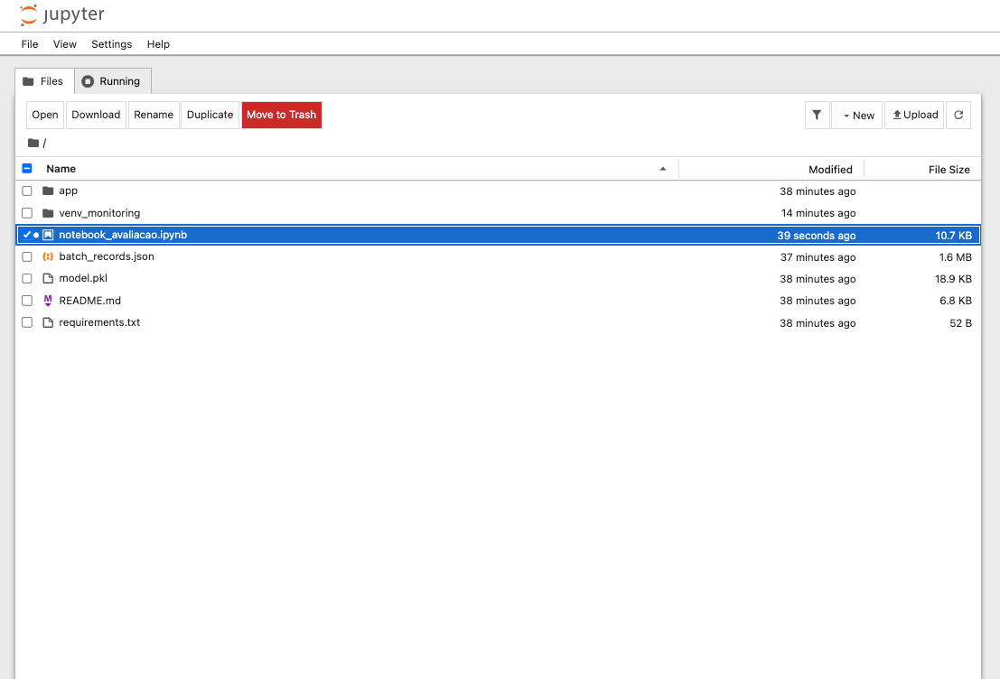
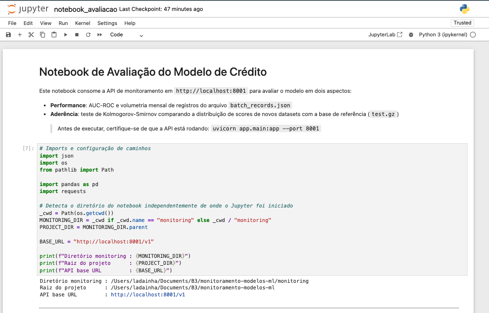
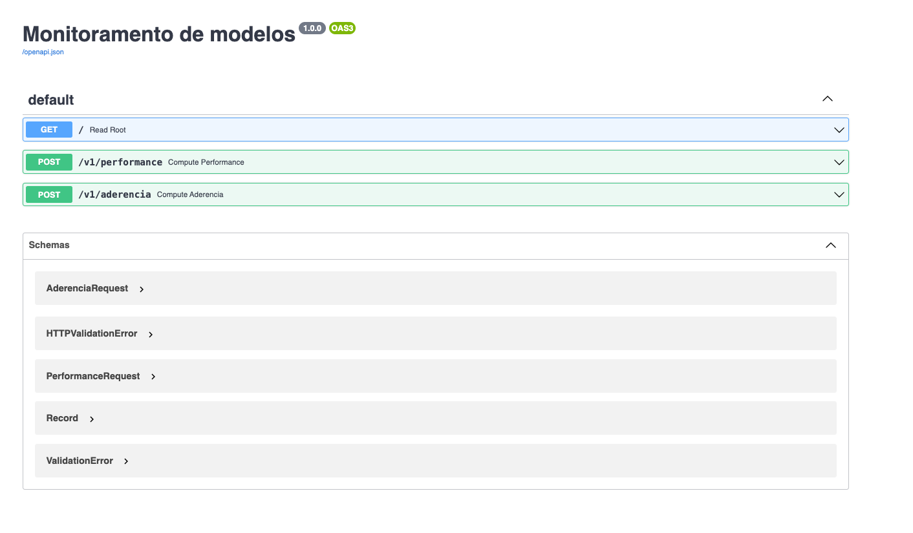
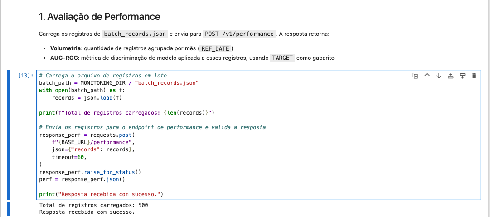
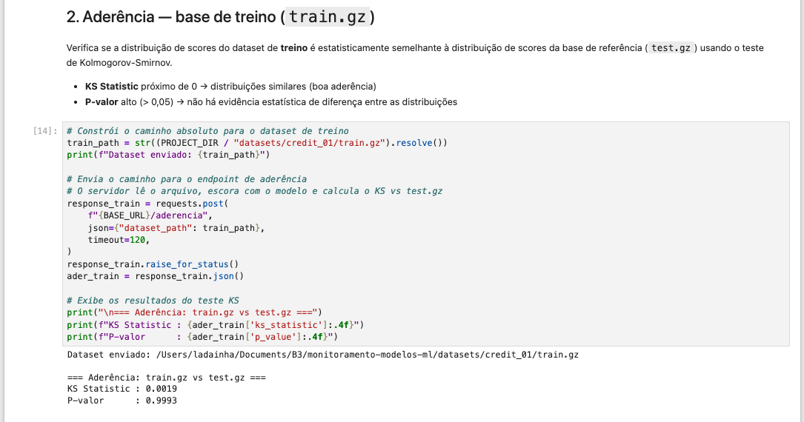
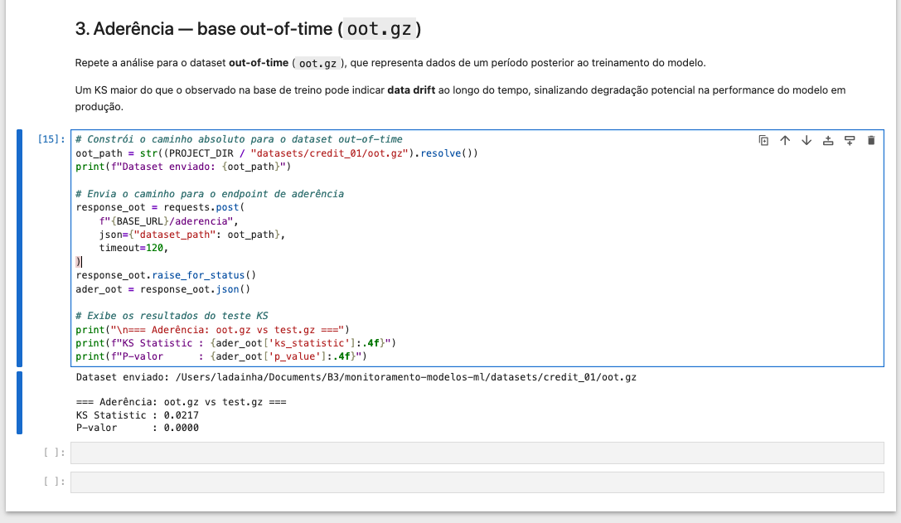

# Monitoramento de Modelos de ML

API REST para monitoramento de modelos de machine learning, desenvolvida como parte de um **desafio técnico de Data Science/ML**. A aplicação expõe dois endpoints para avaliação contínua de um modelo de crédito pré-treinado: um para medir performance (AUC-ROC) e outro para verificar aderência estatística de novos datasets em relação à base de referência via teste de Kolmogorov-Smirnov.

---

## Estrutura do repositório

```
monitoramento-modelos-ml/
├── monitoring/                   # Código-fonte da aplicação
│   ├── app/
│   │   ├── api/
│   │   │   ├── endpoints/
│   │   │   │   ├── aderencia.py
│   │   │   │   └── performance.py
│   │   │   └── routers.py
│   │   ├── main.py
│   │   └── requirements.txt      # Dependências da API
│   ├── batch_records.json        # Registros de entrada (500 registros)
│   ├── model.pkl                 # Modelo pré-treinado
│   ├── notebook_avaliacao.ipynb  # Notebook de avaliação dos endpoints
│   └── requirements.txt         # Dependências do ambiente
├── docs/                         # Evidências / prints
└── README.md
```

---

## Como rodar o projeto localmente

### 1. Pré-requisitos

- Python 3.8+
- `pip`

### 2. Criar e ativar o ambiente virtual

```bash
cd monitoring
python -m venv venv_monitoring
source venv_monitoring/bin/activate        # Linux/macOS
# venv_monitoring\Scripts\activate         # Windows
```

### 3. Instalar as dependências

```bash
pip install -r requirements.txt
```

### 4. Subir a API

Execute o comando a partir da pasta `monitoring/`:

```bash
uvicorn app.main:app --port 8001
```

A API ficará disponível em `http://localhost:8001`.  
A documentação interativa (Swagger UI) estará em `http://localhost:8001/docs`.

### 5. Abrir o notebook de avaliação

Com a API rodando, abra o Jupyter a partir da pasta `monitoring/` e execute o notebook:

```bash
jupyter lab notebook_avaliacao.ipynb
```

O notebook detecta automaticamente o diretório de trabalho e aponta para `http://localhost:8001/v1`.

---

## Endpoints

### `POST /v1/performance`

Avalia a performance do modelo sobre um batch de registros históricos.

**Request**

```json
{
  "records": [
    {
      "REF_DATE": "2017-01",
      "TARGET": 0,
      "feature_1": 1.23,
      "...": "..."
    }
  ]
}
```

Os registros são lidos do arquivo `batch_records.json` (500 registros, período 2017-01 a 2017-08).

**Response**

```json
{
  "volumetria": {
    "2017-01": 58,
    "2017-02": 55,
    "...": "..."
  },
  "auc_roc": 0.5752
}
```

| Campo | Descrição |
|---|---|
| `volumetria` | Contagem de registros agrupada por mês (`REF_DATE`) |
| `auc_roc` | Área sob a curva ROC calculada com a coluna `TARGET` como gabarito |

---

### `POST /v1/aderencia`

Escora um dataset com o modelo pré-treinado e compara a distribuição de scores com a base de referência (`test.gz`) via teste de Kolmogorov-Smirnov.

**Request**

```json
{
  "dataset_path": "/caminho/absoluto/para/dataset.gz"
}
```

O servidor lê o arquivo, aplica o modelo e calcula o KS em relação a `test.gz`.

**Response**

```json
{
  "ks_statistic": 0.0019,
  "p_value": 0.9993
}
```

| Campo | Descrição |
|---|---|
| `ks_statistic` | Máxima diferença absoluta entre as distribuições acumuladas de scores |
| `p_value` | P-valor do teste KS — valores altos (> 0,05) indicam distribuições estatisticamente semelhantes |

Testado com duas bases:

| Dataset | KS Statistic | P-valor | Interpretação |
|---|---|---|---|
| `train.gz` | 0.0019 | 0.9993 | Aderente — mesma época do `test.gz` |
| `oot.gz` | 0.0217 | 0.0000 | Divergência detectada — período posterior |

---

## Evidências

### 1. Estrutura de arquivos do projeto no Jupyter

Visão geral dos arquivos disponíveis na pasta `monitoring/` ao abrir o Jupyter Lab: pastas `app/` e `venv_monitoring/`, além de `notebook_avaliacao.ipynb`, `batch_records.json`, `model.pkl` e `requirements.txt`.



---

### 2. Setup inicial do notebook

Célula de configuração do notebook: imports, detecção automática do diretório de trabalho (`MONITORING_DIR`, `PROJECT_DIR`) e definição da `BASE_URL` apontando para `http://localhost:8001/v1`.



---

### 3. Documentação Swagger da API

Interface Swagger UI (`/docs`) exibindo os dois endpoints disponíveis — `POST /v1/performance` e `POST /v1/aderencia` — e os schemas de request/response correspondentes.



---

### 4. Chamada ao endpoint de Performance — código da requisição

Célula do notebook que carrega os 500 registros de `batch_records.json` e os envia via `POST /v1/performance`. A resposta é recebida com sucesso e armazenada para exibição.



---

### 5. Resultado do endpoint de Performance — volumetria e AUC-ROC

Resposta processada e exibida no notebook: tabela de volumetria por mês (jan a ago/2017) e **AUC-ROC: 0.5752**.


---

### 6. Resultado do endpoint de Aderência — base de treino (`train.gz`)

Chamada ao `POST /v1/aderencia` com `train.gz`. Resultado: **KS Statistic: 0.0019 · P-valor: 0.9993** — distribuição de scores praticamente idêntica à base de referência.



---

### 7. Resultado do endpoint de Aderência — base out-of-time (`oot.gz`)

Chamada ao `POST /v1/aderencia` com `oot.gz`. Resultado: **KS Statistic: 0.0217 · P-valor: 0.0000** — divergência estatisticamente significativa em relação à base de referência.



---

## Interpretação dos resultados de aderência

O teste KS mede a máxima diferença absoluta entre as distribuições acumuladas de scores do novo dataset e da base de referência (`test.gz`). Hipótese nula: as distribuições são iguais.

**`train.gz` — alta aderência (KS 0.0019, P-valor 0.9993)**  
A base de treino pertence ao mesmo período temporal de desenvolvimento do modelo. Espera-se que a distribuição de scores seja praticamente idêntica à de `test.gz` — e é o que o teste confirma: KS próximo de zero e P-valor altíssimo indicam que não há evidência estatística de diferença entre as distribuições.

**`oot.gz` — divergência detectada (KS 0.0217, P-valor ≈ 0)**  
A base out-of-time representa dados de um período posterior ao treinamento. O P-valor praticamente zero rejeita a hipótese nula de igualdade das distribuições, sinalizando **data drift**: o comportamento dos clientes nesse período difere do que o modelo foi treinado para capturar. Embora o KS de 0.0217 seja pequeno em valor absoluto (~2,2% de diferença máxima entre as distribuições acumuladas), a significância estatística indica que o modelo deve ser monitorado e possivelmente retreinado com dados mais recentes para manter sua capacidade preditiva.
